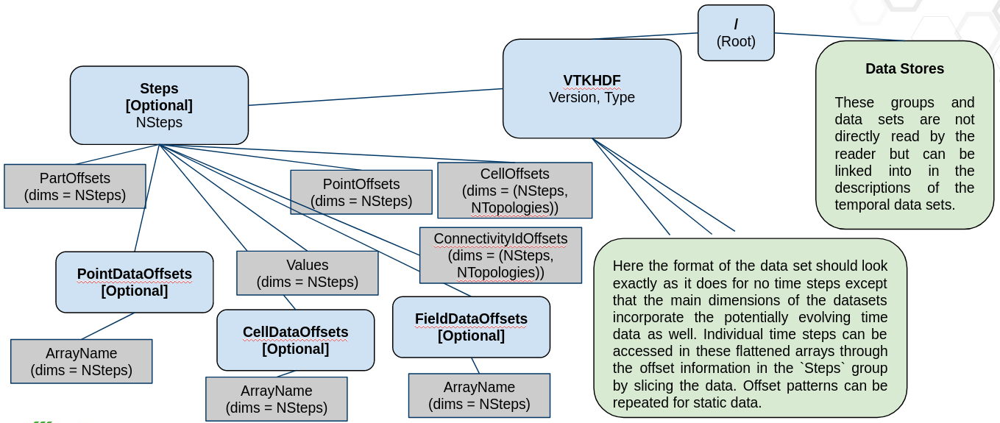

## VTKHDF: Support for transient data

The `VTKHDF` format now supports transient ImageData and UnstructuredGrid. Given the extent of the changes, the `VTKHDF` major version number has been incremented to 2.

Schematically, the extra `Steps` group that contains metadata dictating how to read the transient data looks like this:

Particularities:
* Transient `vtkImageData` have an additional time dimension added to the arrays which should have the following shape [~nSteps, ZDim, YDim, XDim, NComponents] (where the `nSteps` dimension does not necessarily have to have as many entries as time steps and can use the offsetting mechanism to replay data without rewriting it)
* Transient `vtkUnstructuredGrid` have flattened time-space arrays that are read in using the offsetting mechanism
* The `Steps/Values` array holds the time values for each one of the steps
* AMR type structures do not yet support transient data in the format

Specific documentation related to the evolution of the format can  be found at .
