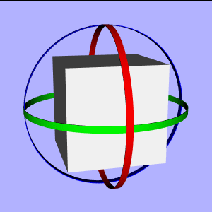
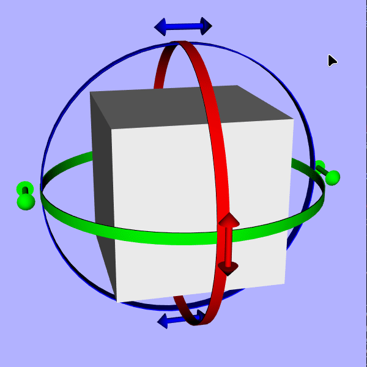

## Add Orientation Widget

You can now rotate any actor through the widget `vtkOrientationWidget`and its
representation `vtkOrientationRepresentation`. For this, you can add a callback
to the widget and set the orientation of your actor using the representation
various getters.

The representation allows you to rotate the widget around X, Y or Z axis by
grabbing the associated torus. The representation can also show additional
arrows around the tori to indicate grabbing direction and help grabbing the
widget. By default, arrows are not shown, and their default look is a diamond.
Their properties can easily be edited in the representation, just like tori
ones, and vtkProperties of actors.

